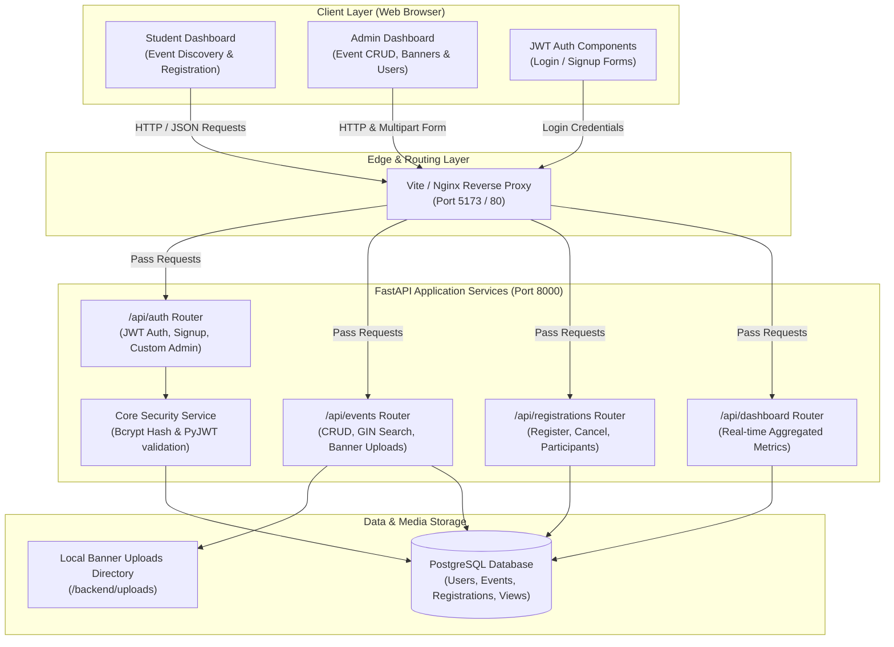
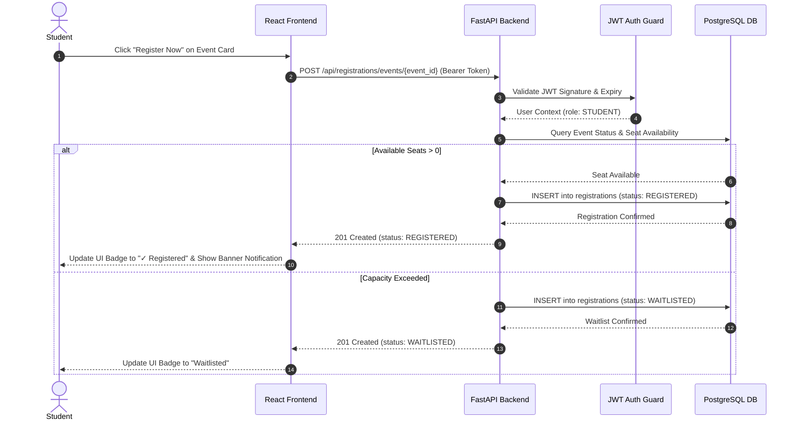
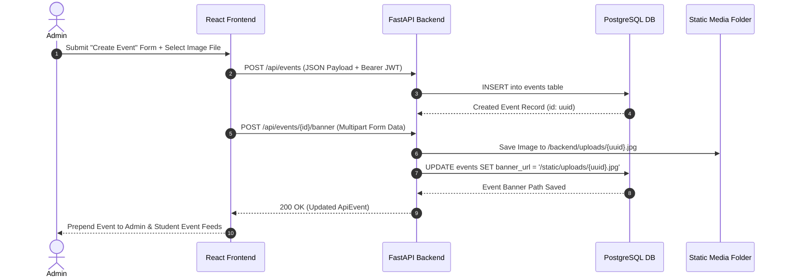
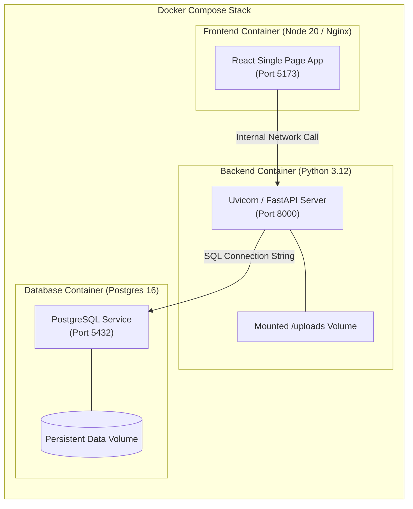

# Campus Event Management Portal - System Architecture

This document presents the system architecture, component interaction workflow, database model design, and container deployment structure for the **Campus Event Management Portal**.

---

## 🏗️ Architecture Overview

The system follows a modern decoupled full-stack microservices pattern composed of:
1. **Frontend Layer**: React SPA built with TypeScript, Vite, Tailwind CSS v3, and PostCSS.
2. **Backend API Layer**: FastAPI (Python 3.12) REST service protected with JWT Bearer Authentication and bcrypt password hashing.
3. **Database Layer**: PostgreSQL database with indexed tables, custom enum types, full-text GIN search indexes, and dynamic aggregate view queries.
4. **Container Orchestration**: Docker Compose isolating `frontend`, `backend`, and `db` services into a virtual network.

---

## 📐 System Architecture Diagram

---

## 🔄 Interaction Flow Sequences

### 1. Student Event Registration Sequence

### 2. Admin Event Creation & Banner Upload Sequence

---

## 🐳 Docker Infrastructure Topology

