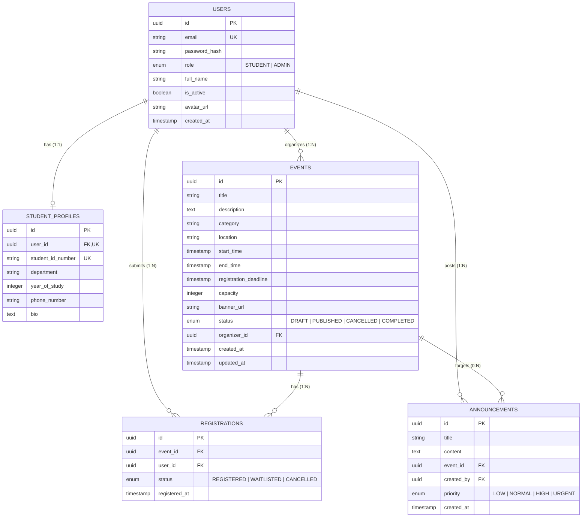

# 🗄️ Database Architecture Specification

This document details the PostgreSQL relational database model, Entity-Relationship (ER) structure, foreign key constraints, indexes, and aggregate view queries for the **Campus Event Management Portal**.

---

## 📐 Entity Relationship Diagram (ERD)




---

## 🗃️ Table Schemas & Constraints

### 1. `users` Table
Stores authentication credentials and account roles.

| Column | Type | Constraints | Description |
| :--- | :--- | :--- | :--- |
| `id` | `UUID` | `PRIMARY KEY, DEFAULT gen_random_uuid()` | Unique user identifier |
| `email` | `VARCHAR(255)` | `UNIQUE, NOT NULL` | Login email address |
| `password_hash` | `VARCHAR(255)` | `NOT NULL` | Bcrypt / SHA256 hashed password |
| `role` | `VARCHAR(50)` | `NOT NULL, DEFAULT 'STUDENT'` | Access role (`STUDENT` or `ADMIN`) |
| `full_name` | `VARCHAR(255)` | `NOT NULL` | Account holder name |
| `is_active` | `BOOLEAN` | `NOT NULL, DEFAULT true` | Account status flag |
| `created_at` | `TIMESTAMPTZ` | `NOT NULL, DEFAULT NOW()` | Registration timestamp |

---

### 2. `student_profiles` Table
Stores extended academic metadata for student accounts (1-to-1 with `users`).

| Column | Type | Constraints | Description |
| :--- | :--- | :--- | :--- |
| `id` | `UUID` | `PRIMARY KEY` | Profile ID |
| `user_id` | `UUID` | `FOREIGN KEY (users.id) ON DELETE CASCADE, UNIQUE` | Associated user ID |
| `student_id_number` | `VARCHAR(100)` | `UNIQUE` | University Student Roll ID |
| `department` | `VARCHAR(100)` | `NULLABLE` | Academic department (e.g. Computer Science) |
| `year_of_study` | `INTEGER` | `NULLABLE` | Year level (1 to 4) |

---

### 3. `events` Table
Stores published campus events and venue capacities.

| Column | Type | Constraints | Description |
| :--- | :--- | :--- | :--- |
| `id` | `UUID` | `PRIMARY KEY` | Event ID |
| `title` | `VARCHAR(255)` | `NOT NULL` | Event title |
| `description` | `TEXT` | `NOT NULL` | Event description |
| `category` | `VARCHAR(100)` | `NOT NULL` | Event category |
| `location` | `VARCHAR(255)` | `NOT NULL` | Venue / Room number |
| `start_time` | `TIMESTAMPTZ` | `NOT NULL` | Event start date & time |
| `end_time` | `TIMESTAMPTZ` | `NOT NULL` | Event end date & time |
| `capacity` | `INTEGER` | `NOT NULL, CHECK (capacity > 0)` | Maximum attendee limit |
| `banner_url` | `VARCHAR(500)` | `NULLABLE` | Uploaded image path |
| `status` | `VARCHAR(50)` | `NOT NULL, DEFAULT 'PUBLISHED'` | Event status |
| `organizer_id` | `UUID` | `FOREIGN KEY (users.id)` | Creating Admin ID |

---

### 4. `registrations` Table
Tracks student registrations and waitlist statuses.

| Column | Type | Constraints | Description |
| :--- | :--- | :--- | :--- |
| `id` | `UUID` | `PRIMARY KEY` | Registration ID |
| `event_id` | `UUID` | `FOREIGN KEY (events.id) ON DELETE CASCADE` | Registered event |
| `user_id` | `UUID` | `FOREIGN KEY (users.id) ON DELETE CASCADE` | Registered student |
| `status` | `VARCHAR(50)` | `NOT NULL, DEFAULT 'REGISTERED'` | Registration status (`REGISTERED`, `WAITLISTED`, `CANCELLED`) |
| `registered_at` | `TIMESTAMPTZ` | `NOT NULL, DEFAULT NOW()` | Enrolled timestamp |

---

## ⚡ Indexes & Optimization

1. **Composite Unique Index**: Prevents duplicate registrations for the same user and event:
   ```sql
   CREATE UNIQUE INDEX idx_unique_active_reg ON registrations(event_id, user_id) WHERE status != 'CANCELLED';
   ```
2. **Full-Text GIN Index**: Accelerates event keyword search queries across title & description:
   ```sql
   CREATE INDEX idx_events_fts ON events USING gin(to_tsvector('english', title || ' ' || description));
   ```
3. **Foreign Key Indexes**:
   ```sql
   CREATE INDEX idx_registrations_user_id ON registrations(user_id);
   CREATE INDEX idx_events_start_time ON events(start_time);
   ```
